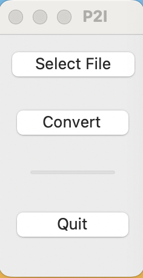

# PNG2ICNS

[](https://opensource.org/licenses/MIT)

This programm converts PNG files to INCS files. This programm is MacOS only.



## General

This programm is created by Eef89. It uses different modules which are stated in requirements.txt. 

It's just a really simple programm, but it works :) However, Eef89 is not responsible for any harm to you Mac.

If there are any comments, please contact me via Eef1989@proton.me


## Usage

This programm can be runned on 3 ways:

### 1. run main.py

Check requirements.txt for the needed modules.

Run:

```python main.py```

### 2. use py2app

Check requirements.txt for the needed modules.

Run:

```python setup.py py2app```

This will create app.

### 3. PBG2ICNS.app

Download PNG2ICNS.app and run this on your macbook.
